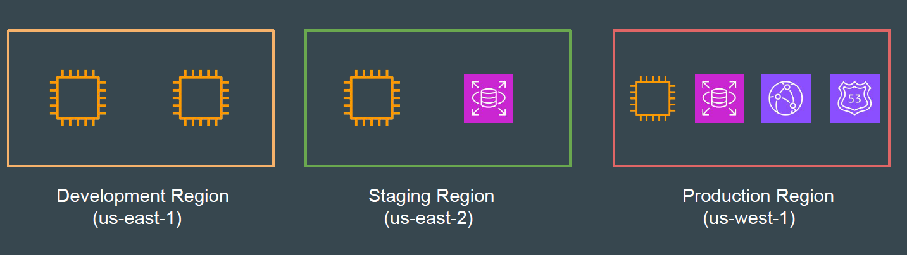
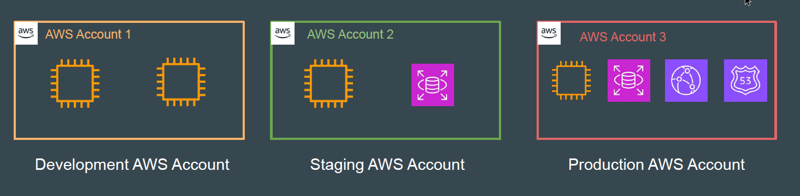
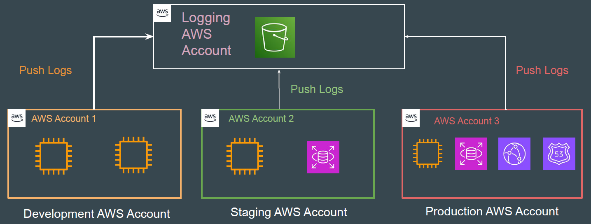
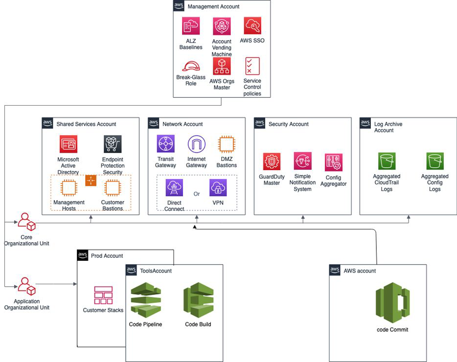
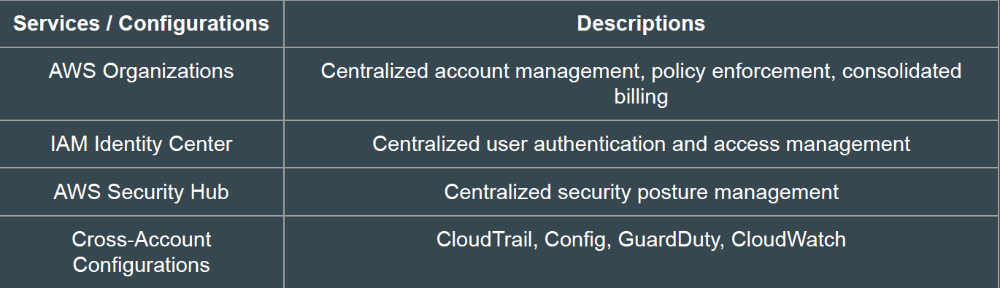

# AWS Multi-Account Strategy

## Legacy Approach

In the legacy approach, organisations used a single AWS account for all of their
environments.
The separation of environments were based on AWS Regions.

## Issues with Legacy Approach

- Security Risks: If credentials are compromised, an attacker could potentially
  access all environments.

- Resource and Service Limits: Many AWS service limits are per-account, not
  per-region. Dev or staging could accidentally exhaust resources needed by
  production.

- Compliance and Auditing: Regulatory requirements often require strong
  isolation. Auditors prefer account-level isolation.

## Multi-Account Architecture

Multi-AWS account architecture is a cloud management strategy in which an
organization utilises multiple AWS accounts to run and manage its workloads.
Each environment can be isolated in a separate AWS account.

## Challenges with Multi-Account Architecture

Centralized Logging and Monitoring: Each AWS account generates its own
CloudTrail, CloudWatch, and other logs. You need to build architectures to
consolidate logs from multiple accounts centrally.

User Management: Many users will require access to all AWS accounts for day
to day operations. You need to build an identity solution for easier management
of identities across accounts.

Billing: You need consolidated billing to get an updated picture of costs across all
AWS accounts.

## Centralized Account Architectures

In this approach, additional AWS accounts are created for specific purposes.
Example: Logging Account, Billing Account, Networking account.

## Multi-Account Architectures can be Complex

## Keys Points to Remember

For multi-AWS account architectures, you must be familiar with cross-account
AWS service-specific configurations and services that enable organizations to
maintain centralized access.

