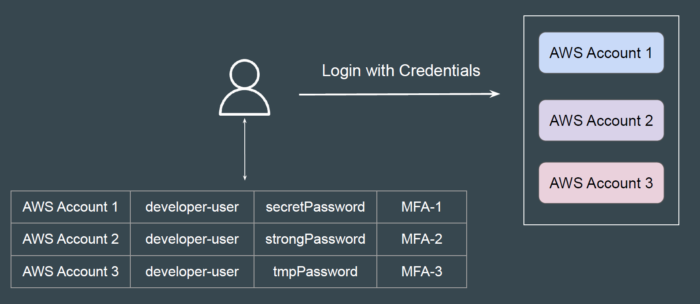
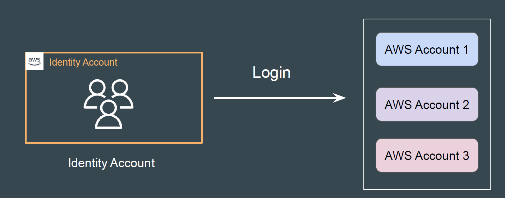
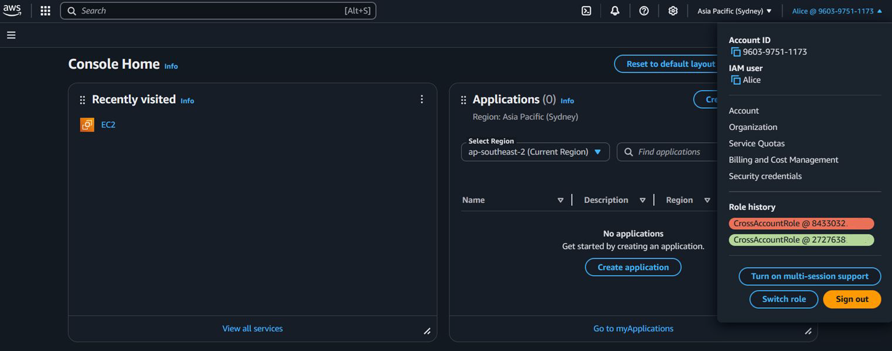
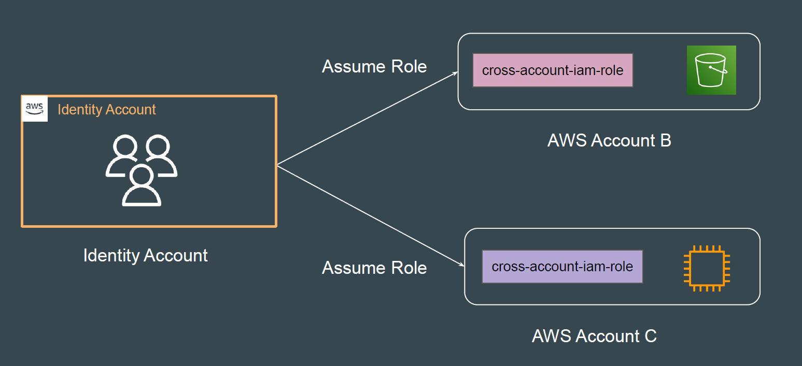
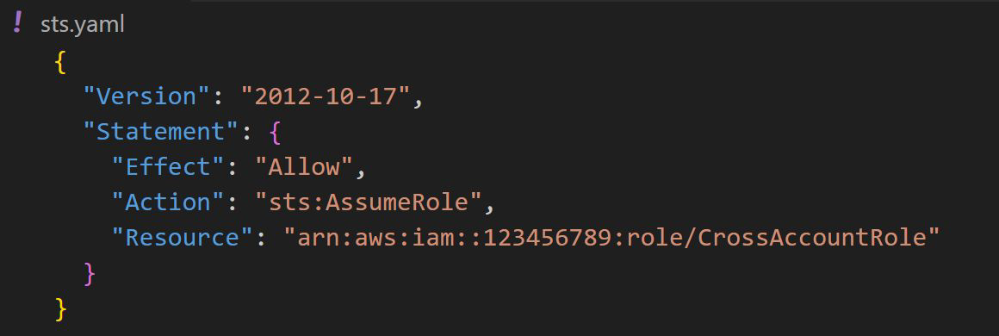

# Identity Account Architecture

## Understanding the Challenge

If an organization uses multiple sets of AWS accounts, having separate
usernames and passwords for each AWS account for users is a challenge.

## Identity Account Architecture

In Identity Account architecture, the IAM users are created and managed in
central AWS Account.
From this central AWS account, they can login to any other AWS accounts.

### Reference Screenshot

## The Practical Architecture

## Advantages and Disadvantages

**Advantages:**
- Simple setup with no extra costs. Fast to configure.

**Disadvantages:**
- Hard to manage when number of roles and AWS accounts increases.
- AWS console access is required for Switch Role operations.

## Practical Workflow Steps

- Create a user in Account A (Identity Account)
- Create a Cross-Account IAM Role in the destination account with
  appropriate trust and policies.
- Allow User to switch to CrossAccountRole.

## Reference Screenshot - STS Assume Role Policy

## Point to Note

You cannot switch to a role when you sign in as the AWS account root user.