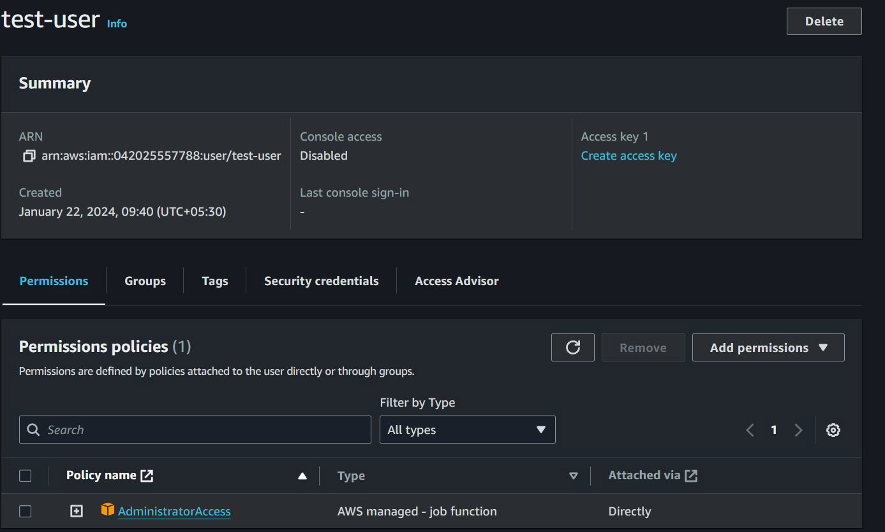

# IAM Policies

## Setting the Base

IAM Policy defines permissions that a specific entity has in AWS.

! [My Image](images/image1.png)

## IAM Policy Types

| **IAM Policy Types**              | **Description**                                                                                                       |
|----------------------------------|-----------------------------------------------------------------------------------------------------------------------|
| **Identity-based policies**      | Attach managed and inline policies to IAM identities (users, groups to which users belong, or roles).                |
| **Resource-based policies**      | Attach inline policies to resources like S3, SQS, and so on.                                                         |
| **Permissions boundaries**       | Define the maximum permissions that the identity-based policies can grant to an entity, but do not grant permissions. |
| **Organizations SCPs**           | Define the maximum permissions for account members of an organization or organizational unit (OU).                   |
| **Access control lists (ACLs)**  | Control which principals in other accounts can access the resource to which the ACL is attached.                      |
| **Session policies**             | Session policies limit permissions for a created session, but do not grant permissions.                              |

## Identity Based Policy

Identity-based policies are JSON permissions policy documents that control
what actions an identity (users, groups of users, and roles) can perform, on
which resources, and under what conditions

## Resource-based policies

Resource-based policies are JSON policy documents that you attach to a
resource such as an Amazon S3 bucket, KMS Keys etc.
You can specify who has access to the resource and what actions they can
perform on it.

! [My Image](images/image3.png)
