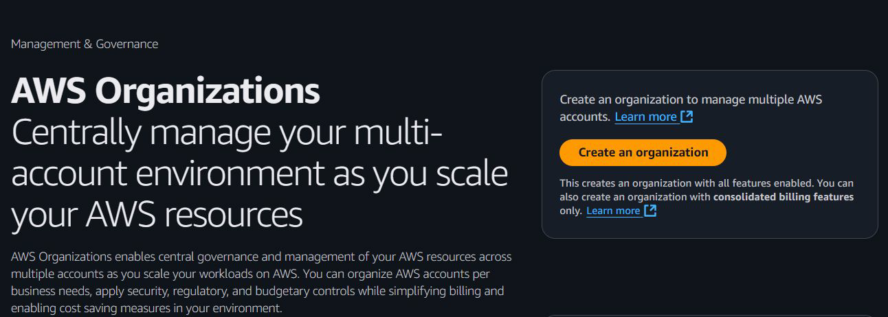

# AWS Organizations

AWS offers centralised policy-based management, as well as the feature of
consolidated billing for multiple AWS accounts through AWS Organisations.

## Management Account
A management account is the AWS account you use to create your organization.
The management account is the ultimate owner of the organization and has final
control over security policies. It also acts as a payer account, responsible for
paying all charges accrued by the accounts within its organization.

## Creation of New AWS Accounts
Through the Management Account, organizations can easily create new sets of
AWS accounts or invite existing accounts.

## Two Important Features
There are two important features of AWS Organizations - Policies and
Consolidated Billing.

## 1 - Consolidated Billing

Consolidated billing is a feature of AWS Organizations that allows you to
combine the billing for multiple AWS accounts into a single bill, thereby
simplifying the payment process.

## Benefits of Consolidated Billing - Volume Discounts

AWS provides volume pricing discounts on numerous service usage.
With consolidated billing, all charges are combined into a single bill, allowing
volume discounts to be applied even if services are used across multiple AWS
accounts.

| **S3 Standard**          | **Storage Pricing**     |
|---------------------------|-------------------------|
| First 50 TB / month       | $0.023 per GB           |
| Next 450 TB / month       | $0.022 per GB           |
| Over 500 TB / month       | $0.021 per GB           |

## 2 - Policies
Policies in AWS Organizations enable you to apply additional types of
management to the AWS accounts within your organization.

| **Policies**                     | **Description** |
|----------------------------------|-----------------|
| Service Control Policies         | Offer central control over the maximum available permissions for IAM users and IAM roles in an organization. |
| Tag Policies                     | Help enforce consistent tagging across resources in your organization. |
| Backup Policies                  | Allow you to centrally manage and apply backup plans to the AWS resources across an organization's accounts. |
| Resource Control Policies        | Offer central control over the maximum available permissions for resources in an organization. |
| AI services opt-out policies     | Allow you to control data collection for AWS AI services for all the accounts in an organization. |
| Security Hub policies            | Allow you to address security coverage gaps that align with your organization's security requirements and centrally applying them across an organization. |
| Chat applications policies       | Allow you to control access to an organization's accounts from chat applications such as Slack and Microsoft Teams. |
| Declarative policies for EC2     | Allow you to centrally declare and enforce desired configurations for EC2 at scale across an organization. |

## Example - Service Controlled Policies
Service control policies (SCPs) are a type of organizational policy that you can
use to manage permissions within your AWS organization accounts.

## Point to Note - SCPs
SCPs don't affect users or roles in the management account.
They affect only the member accounts in your organization.
SCPs do not grant permissions to the IAM users and IAM roles in your
organization. No permissions are granted by an SCP.

## Example - Tag Policies
Tag policies allow you to standardize the tags attached to the AWS resources
across AWS organization's accounts.

## Reference Screenshot - Tag Policies

