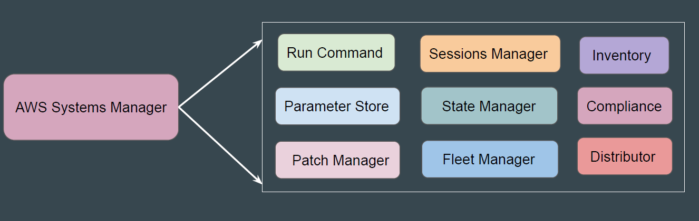
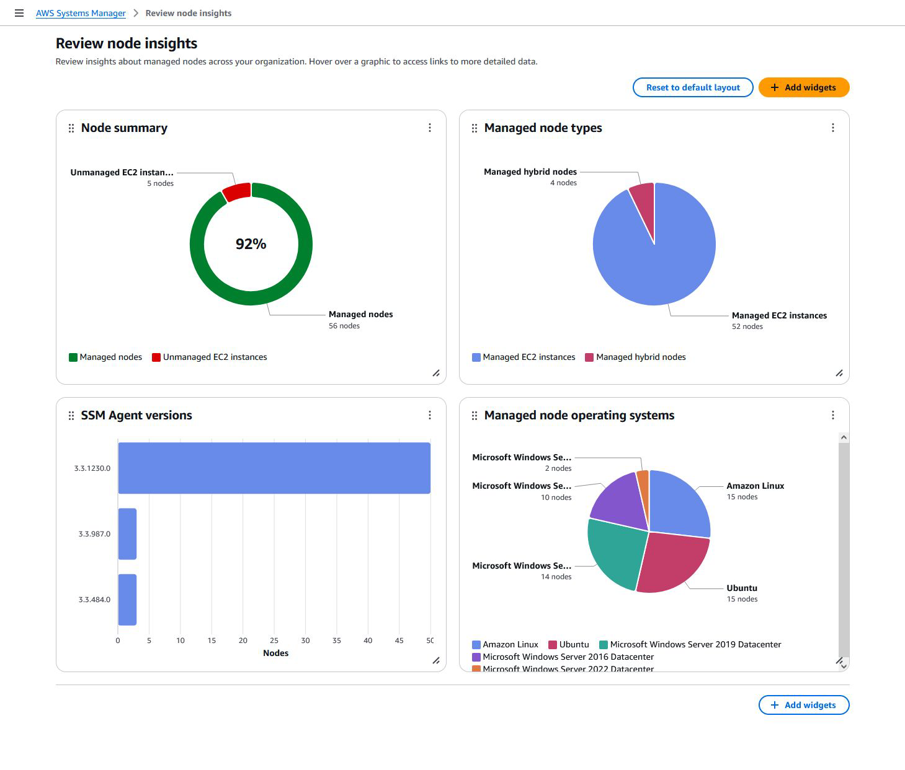
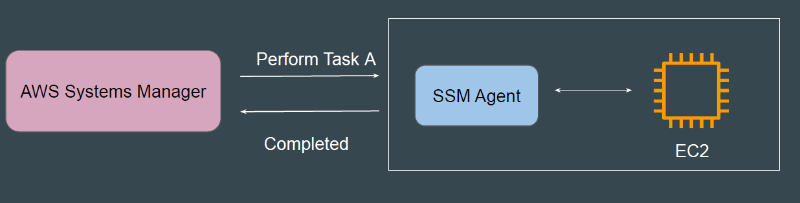

# AWS Systems Manager

AWS Systems Manager is a collection of capabilities that helps you manage
your applications and infrastructure running on AWS and on-premises
environments.

Think of Systems Manager as a central command center where you can
monitor, maintain, and configure your AWS resources at scale without needing to
log into individual servers or instances.

Most AWS Systems Manager features rely on the SSM Agent running on your
EC2 instances.
Through the Systems Manager console, customers can remotely execute
specific tasks and manage their instances by communicating with the installed
agent.

